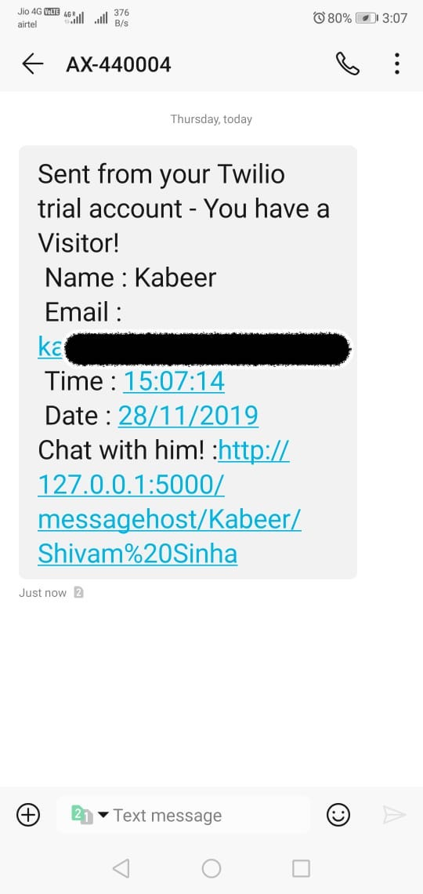
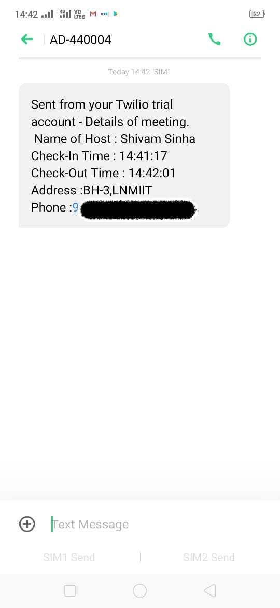

# Entry-Management-Software
This is a project for innovacer-summergeeks 2020, you can find the problem statement here - [Link](https://summergeeks.in/static/assignments/summergeeks%202020%20-%20SDE%20Assignment.pdf).
## Installation
1. Clone this repository.
2. Install the pre-requisites. To install via pip -

`pip3 install -r requirements.txt` 

## Features

### Taking an Appointment

The main home page features this functionality, the visitors can select from the hosts that are available, provide their details and instantly start an appointment.

This triggers an email & text to the host informing him of the appointment, also triggers an email & text to the visitor containing details about the appointment and a link to end the appointment

#### Host Email

#### Host Phone

#### Visitor Email to end Appointment

#### Visitor Message to end Appointment

### Taking an Remote Appointment(Chat)

The main home page also features this functionality(see photo above), this feature allows the visitor to take a remote appointment i.e chat with the host, can be used when the host is working from home, this feature enables the host to still keep their meeting schedule intact without any hindrance.

When clicked, links are sent to the host for their corresponding chatboxes, while the  visitor chatbox is opened when the appointment is taken itself, these pages also feature a link to end the ongoing appointment at any time.

#### Host Text with link for the chat

#### Host Mail with link for the chat 

#### Visitor ChatBox

#### Host ChatBox

The messages work in real-time.

### Ending Appointment

The meetings can be ended by the Visitor by visiting the link sent to them.

When the meeeting is ended by the visitor, a page with details of the meetings is shown to them, also the email and text is sent with the details.
#### Visitor Email

#### Visitor Text

#### Detail Page

### Host Panel

The Host Panel can be accessed by the link on the home page.
The Host Panel features -

#### Add Host

New hosts can be added here.

#### Delete Host

Saved hosts can be deleted here.

#### Host Details

This lists details available for meetings held by the selected host.

When selected, the page shows the details -

## Tech Stack

### Python3

I chose Python3 as the language to make this project in because
1. I was comfortable with it becuase of my previous experience with it as I had extensively used it for scripting.
2. A lot of frameworks and third party libraries were available which would be of utmost use during the project.

### Flask

I chose Flask as the Web App Framework for my site because
1. All the features I wanted to add could be added through third-party libraries.
2. Gave me more control over the structure over the website as compared to Django, which I though would be better for me, as the project was being solely done by me.

### SQLite3

I chose to use SQLite3 as the database client becuase

1. SQL commands can be used to maintain the database.
2. Embedded in the app so greater degree of freedom.
3. Nice integration with Flask.

The emails were sent using smtplib and messages using the Twilio API.

